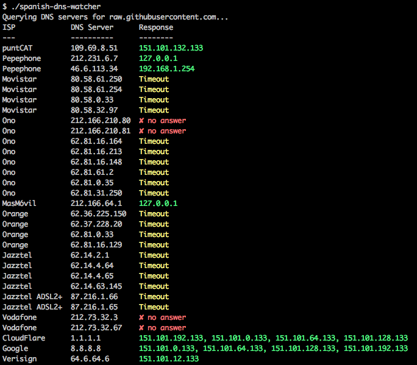

# Spanish DNS Watcher

En noviembre de 2019, el Gobierno de España ordenó a los proveedores de internet (ISP) el bloqueo por DNS de la resolución de varios nombres de internet, incluido el conocido [raw.githubusercontent.com](raw.githubusercontent.com), usado en multitud de empresas y proyectos de código libre y propietario.

Esto viene de la mano del [Decreto Ley 14/2019](https://boe.es/boe/dias/2019/11/05/pdfs/BOE-A-2019-15790.pdf) aprobado por el Gobierno del PSOE con el apoyo del PP y Ciudadanos, y la abstención de UNIDAS-PODEMOS, que refuerza el control del Gobierno y debilita el poder judicial, al asignarse autoridad para «intervenir las redes de telecomunicaciones por motivos de "orden público" sin que un juez le autorice a ello.» (cita del jurista Sergio Carrasco en el artículo [El decreto "contra la república digital catalana" que no nombra a Catalunya y sí da más capacidad al Gobierno para intervenir Internet](https://www.eldiario.es/tecnologia/Claves-decreto-intervenir-Intervenir-miercoles_0_967653357.html))

He hecho este script para comprobar la resolución de servidores DNS españoles (y algunos extranjeros para comparar).

## Ejecución del script

Necesitas un entorno Python 3 con pip3. Para instalarlo en Ubuntu:

    $ sudo apt install python3 python3-pip

Clona el repositorio e instala las dependencias:

    $ git clone https://github.com/santigz/spanish-dns-watcher.git
    $ cd spanish-dns-watcher
    $ pip3 install -r requirements.txt

Ejecuta el script:

    $ ./spanish-dns-watcher

Puedes pasarle cualquier nombre de dominio:

    $ ./spanish-dns-watcher mozilla.org

Tarda varios segundos en obtener las respuestas de los servidores (timeout de 5 s.) Las peticiones se envían en paralelo (hasta 50 simultáneas).

## Q&As

**¿Por qué la mayoría de los servidores DNS no responden?**

Es una práctica común que los ISP sólo permitan el uso de sus servidores DNS a clientes que pagan por sus servicios. Por lo tanto, sólo verás respuesta en el servidor de tu ISP.

**¿Entonces por qué has puesto tantos servidores?**

Porque me conecto desde varias redes a diario, y quiero algo sencillo. Y así tú puedes ejecutar el mismo código y ver la respuesta de tu ISP ;)

**¿Por qué el servidor `puntCat` sí que responde?**

Los servidores DNS de puntCAT están abiertos, al igual que hacen otras organizaciones como Google o Cloudflare.

Este servidor lleva top-level domain `.cat` y está gestionado por la Funcación puntCAT, que ha sido protagonista de eventos importantes en Cataluña, entre otros por gestionar el dominio del referendum del 1-O:
- [El Govern se apropia del dominio de internet .cat como “estructura de Estado”](https://elpais.com/ccaa/2018/10/09/catalunya/1539110244_940549.html)
- [La justicia desmonta la organización del referéndum ilegal de Cataluña](https://elpais.com/ccaa/2017/09/20/catalunya/1505885372_273143.html)
- [@puntCAT: Right now spanish police @guardiacivil is doing an intervention in our office @ICANN](https://twitter.com/puntcat/status/910446518494269440)
- [Quiénes son los 14 detenidos en la operación contra el referéndum](https://www.eldiario.es/catalunya/politica/detenidos-operacion-referendum_0_688731968.html)

